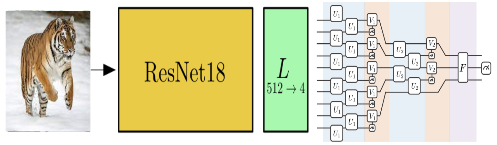

# NTUQ-2023-Ephys-Challenge

## Model : Quantum transfer learning with quantum pooling layer
The idea of **transfer leanring** [1] is to feed the data through pre-trained feature extraction networks first, and train only a small size feed forward netwrok after it to fine tune the moedel with respect to a specific data set.

Since CIFAR100 image data are too large to directly encode in quantum circuits today, we here rely on a "imagenet" pre-trained ResNet18 as feature extraction layer. The image feature is reduced to 4 dimension through this network, and encoded into a 4 qubit circuit network. 

We then utilize the idea of quantum pooling layer[2] to further reduce the quantum curcuit to a single qubit. A single qubit is sufficient for binary classification by chooing the eigenstate with higher probability.

## Data pre-processing
Resize -> 256*256\
Center -> 224*224\
Normalize to std. (0.485, 0.456, 0.406), (0.229, 0.224, 0.225)

## Environment & Package
Notebook: Google CoLab
python 3.10
pennylane==0.28
Pre-trained model: torchvision.models.resnet18

## Reference
[1]Mari, A., Bromley, T. R., Izaac, J., Schuld, M., & Killoran, N. (2020). Transfer learning in hybrid classical-quantum neural networks. Quantum, 4, 340.
[2]Cong, I., Choi, S., & Lukin, M. D. (2019). Quantum convolutional neural networks. Nature Physics, 15(12), 1273-1278.
